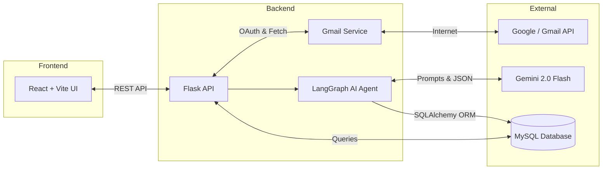
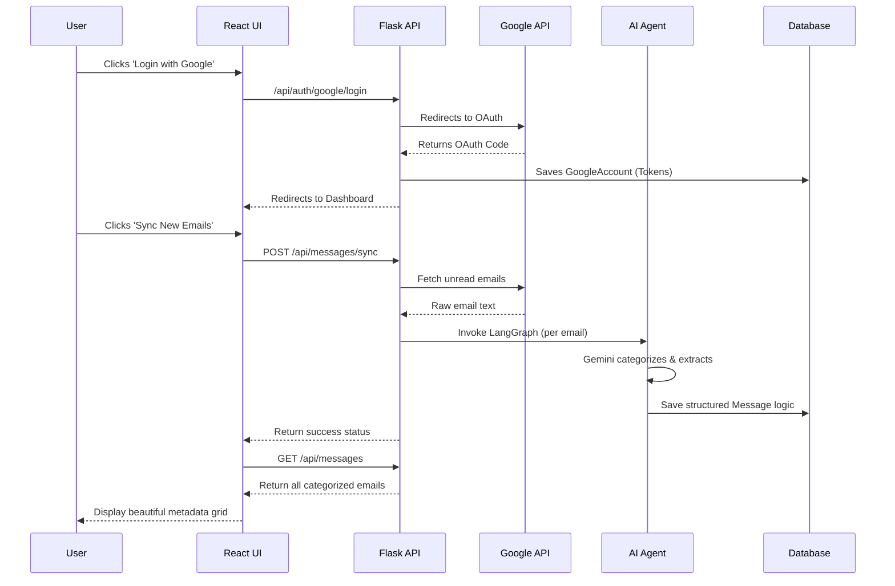

# Unified Inbox - AI Mail Sorting Agent

## Project Overview
Unified Inbox is a software product that automatically reads unread emails, uses a Large Language Model (Gemini 2.0 Flash) to evaluate their priority (e.g., flagging interviews as "High"), extracts dynamic structured metadata (like interview dates or topics), and saves them into a relational database.

## System Architecture

## User Flow

## Key Technical Decisions

### 1. Structure & Boundaries
- **Separation of Concerns:** The backend is divided into clear layers: API routes (`app/api/`), Database access (`app/db.py` & `app/models.py`), AI Business Logic (`app/services/ai_service.py`), and the Agent Graph (`app/agents/message_graph.py`).
- **Graph-Based Agent:** Used LangGraph to structure the AI processing pipeline into discrete nodes (`analyze` -> `decide` -> `alert` -> `store`). This prevents massive, monolithic LLM calls and makes the flow predictable and observable.

### 2. Simplicity & Correctness
- **Simple React Frontend:** Avoided complex state management libraries (like Redux) in favor of simple React hooks (`useState`, `useEffect`) since the current scope only requires fetching and syncing data.
- **Synchronous Database Operations:** Used standard SQLAlchemy ORM (sync) rather than async SQLAlchemy to reduce complexity and prevent race conditions or session management bugs during the AI evaluation phase.

### 3. Interface Safety
- **Pydantic Schemas:** Used Pydantic (`app/schemas.py`) to enforce strict type hints and data validation at the API boundary, guaranteeing that the frontend receives exactly the data structure it expects.
- **Relational Data Integrity:** Migrated from SQLite to MySQL with strictly enforced `VARCHAR` lengths (`String(255)`) to ensure database schemas strictly dictate data bounds, protecting against malformed AI outputs.

### 4. Change Resilience & Extension
- **Dynamic Metadata Column:** Instead of hardcoding columns for Every possible AI extraction (e.g., `interview_date`, `flight_time`), we use a `metadata_json` column. If the AI prompt is updated to extract new fields, the database schema does not need to change, preventing widespread impact.

### 5. Verification & Observability
- **Error Handling & Fallbacks:** The AI service includes a 3-retry mechanism with exponential backoff for rate limits. If it fails entirely, it returns a generic fallback object instead of crashing the server, ensuring observability via terminal logs while maintaining system uptime.

### 6. Why Custom Architecture vs. Zapier/Make
Developers often automate emails using no-code tools like Zapier to forward summaries to Slack. Building this entirely from scratch provides several architectural advantages:
- **True Agentic Control (Data Sovereignty):** Zapier workflows are linear and lock the data within third-party webhook ecosystems. By building a custom graph with LangGraph and executing it against our own database, we own the state. Our data model (`Message` and `GoogleAccount`) allows us to train future models or build arbitrary frontends, which is impossible if the data simply flashes across a Slack webhook.
- **Relational Complexity:** Zapier struggles with many-to-many relationships or complex dynamic metadata extraction that needs to be relationally mapped to an end-user. Our `metadata_json` schema inherently allows relational querying and strict data bounding.
- **Extensibility & Security:** A custom FastAPI/Flask backend means we can implement our own strict OAuth flows and role-based access controls. We don't have to give a third-party workflow tool God-mode access to users' inboxes; instead, we programmatically request only the exact `gmail.readonly` scopes we restrict ourselves to.
